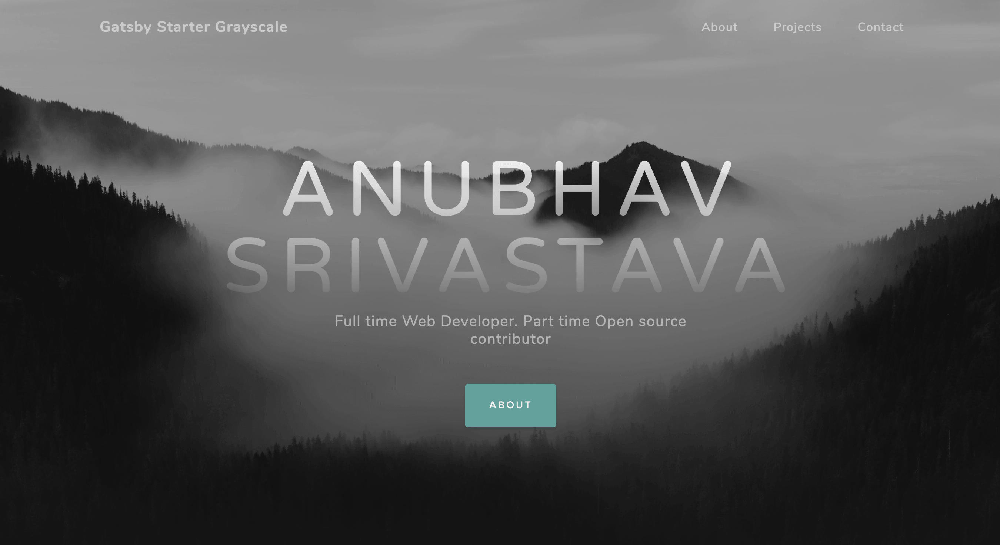

# gatsby-starter-grayscale

Gatsby.js V4 starter template based on Grayscale by startbootstrap

For an overview of the project structure please refer to the [Gatsby documentation - Building with Components](https://www.gatsbyjs.org/docs/building-with-components/).

Check online preview [here](https://anubhavsrivastava.github.io/gatsby-starter-grayscale/)

## Screenshot

### Contribution

Suggestions and PRs are welcome!

Please create issue or open PR request for contribution.

### License

refer `LICENSE` file in this repository.
